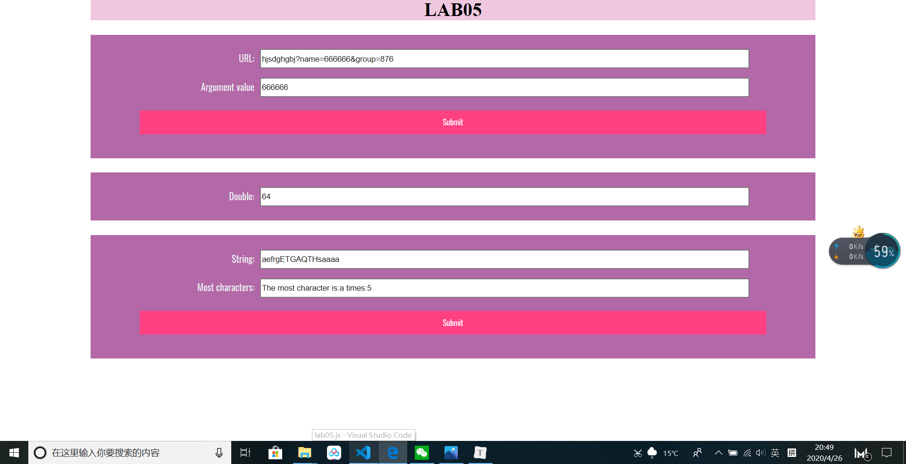
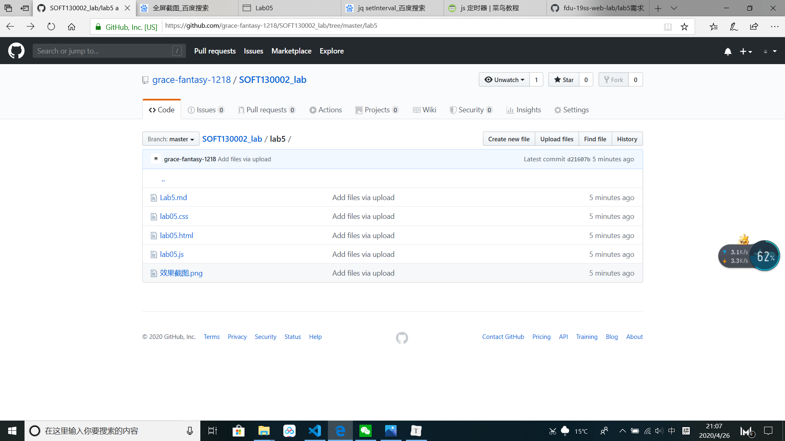

## Lab5

#### 第一部分

**Js构思**

先获得url的值，存在str里面。根据 “？”，“&”，“=” 三个符号将str分成strs数组，分别对应：若干字符串；参数名1；参数1值；参数2；参数2值......用for循环逐个判断第 i 个字符串为name，并赋url_result.value 为第（i + 1）个字符串；若没有name，则输出无“name”

**相关知识点**

url语句；数组，split；条件，循环语句

**遇到的小问题**

1. ```
   var strs = str.split("?=&");
   ```

    语法错误，使用了split单一分割的语法，应使用 var strs = str.split(/[?=&]/); 

2. 发现输入任何值，输出为"无name"

   if条件语句没有break，else语句输出结果覆盖了if的结果

#### 第二部分

**js构思**

在timeTest外部设一个定时函数int，每5s运行一次；设一个变量times，每运行一次int， times++，即 2 的指数项++。timeTest的内部给mul复制。一个条件语句，使times加到11时停止运行；或者设定时器，使整分时停止运行，getMilliseconds()获取到毫秒以减少误差。

**相关知识点**

获取时间；定时器setInterval和clearInterval；条件，循环语句

**遇到的小问题**

一开始想用if语句，当getseconds（）== 0 时终止，但可能因为小数点后的误差，该想法不成立。

#### 第三部分

**js构思**

先获取most.value的值，一个二维数组json。for循环语句，如果str1的字符没有读到过，建一个新的json[字符]=1，如果读到过就在原来的数值上++。第二个for语句遍历json，设一变量max，当有新的数值大于max，就取新的数值。

**相关知识点**

二维数组；for_in语句遍历

### 效果

### github截图

