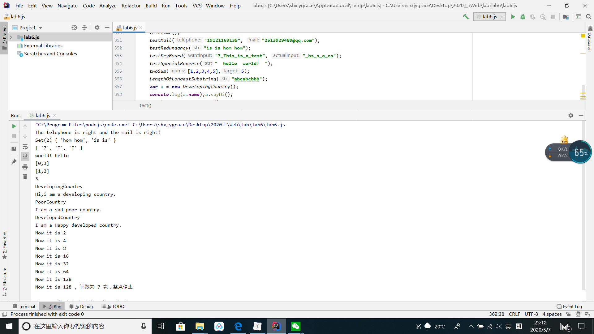
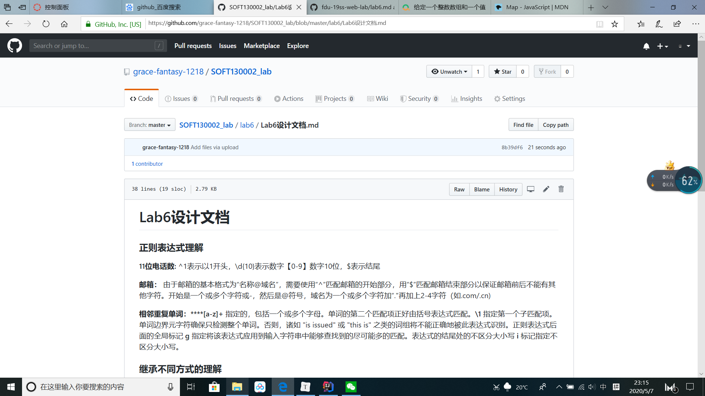

# Lab6设计文档

### 正则表达式理解

**11位电话数:**    ^1表示以1开头，\d{10}表示数字【0-9】数字10位，$表示结尾

**邮箱：**    由于邮箱的基本格式为“名称@域名”，需要使用“^”匹配邮箱的开始部分，用“$”匹配邮箱结束部分以保证邮箱前后不能有其他字符。开始是一个或多个字符或-，然后是@符号，域名为一个或多个字符加“."再加上2-4字符（如.com/.cn)

**相邻重复单词：****[a-z]+** 指定的，包括一个或多个字母。单词的第二个匹配项正好由括号表达式匹配。**\1** 指定第一个子匹配项。单词边界元字符确保只检测整个单词。否则，诸如 "is issued" 或 "this is" 之类的词组将不能正确地被此表达式识别。正则表达式后面的全局标记 **g** 指定将该表达式应用到输入字符串中能够查找到的尽可能多的匹配。表达式的结尾处的不区分大小写 **i** 标记指定不区分大小写。

### 继承不同方式的理解

**构造函数：**用来在创建对象时初始化对象，与new运算符一起使用来实例化对象。构造函数在实例化对象时，每一个子类都将调用一次父类构造函数。**

**原型链：**每一个对象都有自己的原型对象，原型对象也有自己的原型对象，这样就形成了一个链式结构。对这个实例化对象而言，访问对象的属性，是首先在对象本身去找，如果没有，就会去他的原型对象中找，一直找到原型链的终点；如果是修改对象的属性，如果这个实例化对象中有这个属性，就修改，没有这个属性就添加这个属性。

**Object.create()**是让一个对象的原型继承另外一个对象；所以虽然可以访问成功的，但实际上其本身并没有这些属性，而是原型上有这些属性。

任何函数都是函数，他都继承Function的所有属性和方法，而Function是内置的构造函数，也是对象，都是继承Object的所有属性和方法。

### Map、Set、Array之间的区别和使用。

遍历Map和Set无法像Array那样使用下标。Array/Map/Set都属于iterable类型。它们都允许按键存取一个值、删除键、检测一个键是否绑定了值。

**map**

map指映射，返回运行后的数组。初始化map并通过key来取value，后面set的值会覆盖前面设的。

**set**

set存储的是一组不重复的key。`Set`与`Array`类似，但`Set`没有索引，因此回调函数的前两个参数都是元素本身：****使用 Set 可以很容易地实现并集（Union）、交集（Intersect）和差集（Difference）。**

### 本地命令行截图

### Github截图

